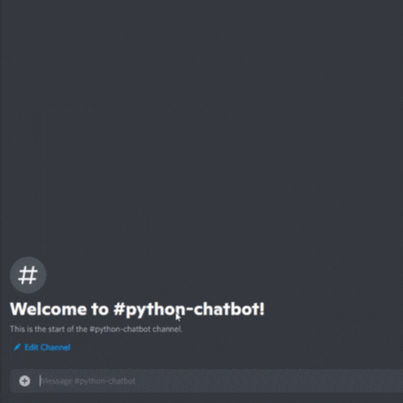

<h1>rfBot - DiscordChatBot</h1>

An AI Python-Based Discord Chatbot that you can talk to if you are alone. 

Add my bot to your Discord server - <b>[rfBot](https://discord.com/api/oauth2/authorize?client_id=890168520883699722&amp;permissions=2048&amp;scope=bot)</b>

This project was inspired by <b>[Lynn's DevLab](https://www.youtube.com/channel/UCZ2MeG5jTIqgzEMiByrIzsw)</b>

<b>Sources that I used for this project:</b> [Video](https://youtu.be/UjDpW_SOrlw), [Github Source](https://github.com/RuolinZheng08/twewy-discord-chatbot), [freecodecamp](https://www.freecodecamp.org/news/create-a-discord-bot-with-python/)
  
<i>I use this sources for educational purposes only and not for commercial purposes.</i>

<b>A little demo:</b>

